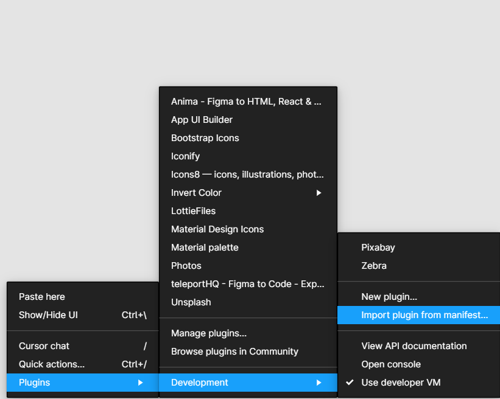

# Figma Database Modeler

  Uses Figma to model Relational databases. Once the database is modeled, a user can click <em> View SQL </em> to retrieve the necessary SQL to construct their database.

 

<h3>Technologies used</h3>
<ul>
    <li>
        React-Related
        <ul>
          <li>
            React
          </li>
          <li>
            Material UI
          </li>
          <li>
            Custom React Hooks
          </li>
          <li>
            Redux
          </li>
        </ul>
    </li>
    <li>
      WebPack
    </li>
    <li>
      TypeScript
    </li>
    <li>
      SQL
    </li>
    <li>
      Figma Design
    </li>
    <li>
      Figma API
    </li>
    <li>
      Shared Web-Workers
    </li>
</ul>

<h3>How to use</h3>
<ul>
    <li>
        After Cloning, go to Figma Design and right click on the white space. This will bring up the options menu.
    </li>
    <li>
        Go to Plugins -> Development -> Deploy - Import Plugin from Manifest
        
    </li>
    <li>
      Select the manifest file from the cloned repository.
    </li>
</ul>
